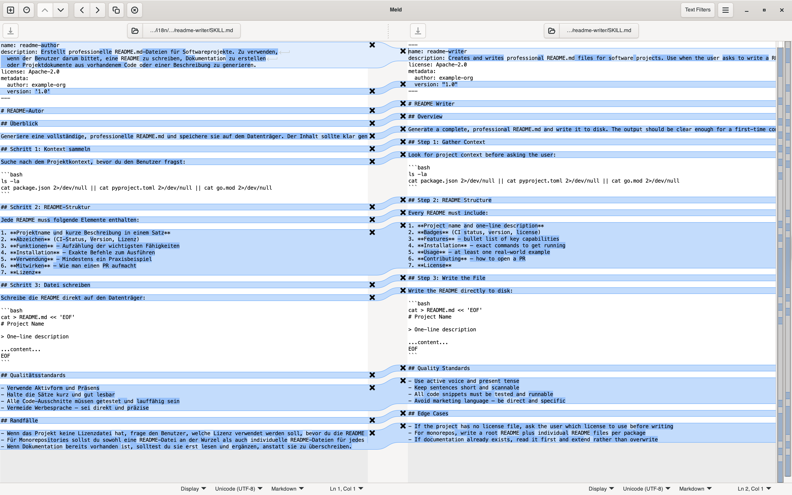
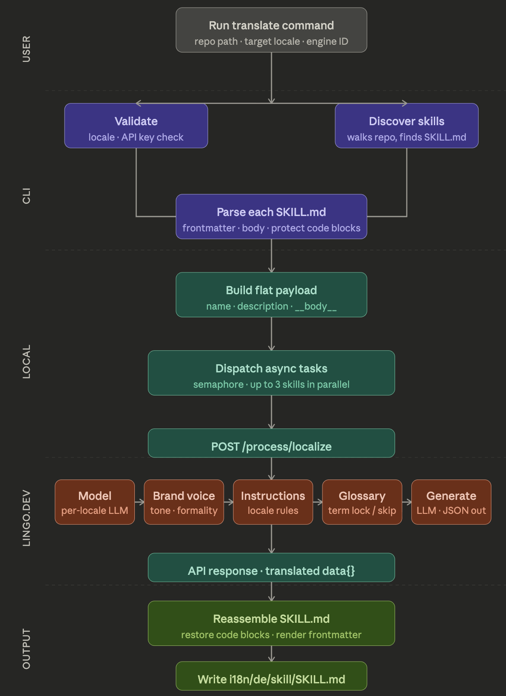

# 🌐 skills-i8n
> **i8n for AI Agent Skills** — translate your `SKILL.md` repository to any of 83+ languages, powered by [Lingo.dev](https://lingo.dev).

---

AI agents are going global. Your skills should too.

`skills-i8n` takes any skills repository following the [Agent Skills open standard](https://agentskills.io/) and translates every `SKILL.md` — comments, descriptions, instructions, and all — into the language your team (or your agent's users) actually speaks.

It preserves code blocks, structure, and technical terms. It copies companion files (`scripts/`, `references/`, `assets/`) untouched. And it does it all **concurrently**, in seconds.

---

## ✨ Features

- **Complete SKILL.md support** — Translates `name`, `description`, and the entire Markdown body
- **Structure-aware** — code blocks, headings, tables are preserved; only human-readable text is translated
- **Technical glossary** — Agent-domain terms (`SKILL.md`, `Claude`, `MCP`, `LLM`, `API`) are never mistranslated
- **Concurrent translation** — Configurable parallelism for large skill repos
- **Companion file preservation** — `scripts/`, `references/`, `assets/` are copied as-is
- **Auto-discovery** — Finds skills in flat repos, `skills/*/`, `.claude/skills/*/`, `.agents/skills/*/`
- **Language detection** — Auto-detect the source locale of any `SKILL.md`

---

## 📦 Installation

Requires Python 3.11+ and [uv](https://github.com/astral-sh/uv).

```bash
# Clone the repo
git clone https://github.com/srini047/skills-i8n
cd skills-i8n

# Install dependencies
uv sync

# Set your Lingo.dev API key(s)
export LINGODOTDEV_API_KEY=your_key_here
export LINGODOTDEV_ENGINE_ID=your_engine_id # optional
```

Get a free API key at [lingo.dev](https://lingo.dev).

---

## 🚀 Quick Start

```bash
# Help command to get accustomed to commands
uv run skills-i8n --help

# Translate a skills repo to German
uv run skills-i8n translate ./my-skills de

# Translate to Spanish, output to a custom directory
uv run skills-i8n translate ./my-skills es --output ./translated-skills

# Translate to multiple languages (run in sequence or convert to a bash script)
for locale in fr de ko zh; do
  uv run skills-i8n translate ./my-skills $locale --output ./i8n
done

# Scan before translating
uv run skills-i8n scan ./my-skills

# See all supported locales
skills-i8n list-locales

# Filter locales by name
uv run  skills-i8n list-locales --filter chinese

# Auto-detect the language of a SKILL.md
uv run  skills-i8n detect ./my-skills/pdf-processing/SKILL.md
```

---

## 📁 Sample Output Structure

Given a skills repo like:

```
my-skills/
├── pdf-processing/
│   ├── SKILL.md
│   └── scripts/
│       └── extract.py
├── readme-writer/
│   └── SKILL.md
└── code-review/
    └── SKILL.md
```

Running `uv run skills-i8n translate ./my-skills de --output ./i8n` produces:

```
i8n/
└── de/
    ├── pdf-processing/
    │   ├── SKILL.md          ← translated
    │   └── scripts/
    │       └── extract.py    ← copied as-is
    ├── readme-writer/
    │   └── SKILL.md          ← translated
    └── code-review/
        └── SKILL.md          ← translated
```

Sharing sample output diff:


---

## How it works



---

## 🌍 Supported Languages

83+ languages including:

| Code | Language | Code | Language |
|------|----------|------|----------|
| `es` | Spanish | `ja` | Japanese |
| `fr` | French | `ko` | Korean |
| `de` | German | `zh` | Chinese (Simplified) |
| `hi` | Hindi | `ru` | Russian |
| `it` | Italian | `nl` | Dutch |

Run `uv run skills-i8n list-locales` to see complete list

> [!NOTE]
> Incase a locale is not supported or any current supported locale doesn't work feel free to reach out to me or raise an issue with minimal repro. Happy to solve the bug.

---

## 📄 License

Apache 2.0 — see [LICENSE](LICENSE).

---

Built at a hackathon because agents deserve to speak every language. 🚀
